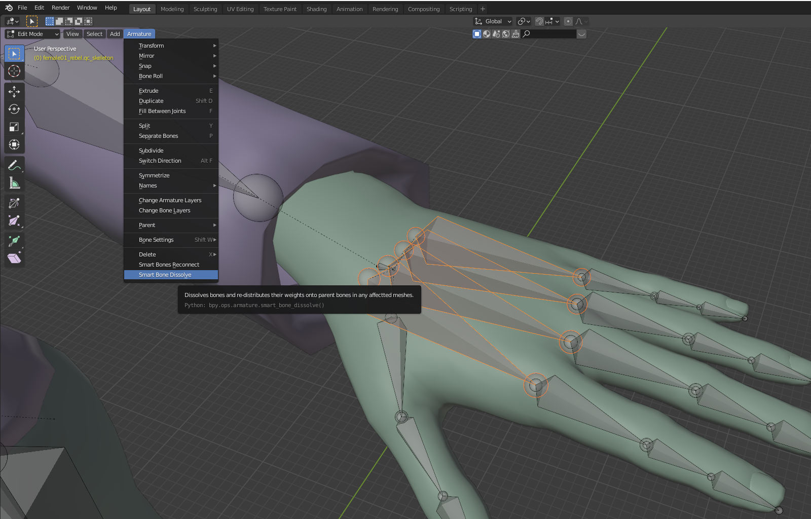

# Smart Bone Dissolve - blender Addon
This blender addon is aimed to ease the process of removing excess bones from an armature of an already rigged mesh or collection of meshes, while also preserving their weights. A comon use case would be turning a model initially rigged for animation into a game-ready model with a less complex armature

## Examples
Example below shows a rigged model of a characters hand, with it's palm weight painted to 1 root hand bone and 4 carpal palm bones.

Consider we only need the rig to have a single hand/wrist bone instead. Simply removing the 4 carpal bones is not enough, because then the hand will need to be re-painted. By simply applying the addon, not only do the bones get dissolved, but also all of their weight paints get transferred to the parent hand bone:

## How it works
Applying the addon to any number of selected armature bones will dissolve them and add their weights to any remaining parent bones weights

This applies to all meshes that are parented to the selected armature and use it in an Armature modifier

If a mesh does not have a vertex group corersponding to a dissolved bone, it will not be affected

If a mesh has a vertex group corersponding to a dissolved bone, but not one of a parent bone, then it will be created and populated

Redundant vertex groups of all dissolved bones will be removed from affected meshes

## How to install
 - Download the included **SmartBoneDissolve.py** file
 - In blender, go to **Edit > Preferences > Add-ons**
 - Click the **Install** button and select the **SmartBoneDissolve.py** file
 - Enable the addon with the checkmark
 
 ## How to use
 - Once installed, the option will appear under the **Armature menu** in 3D View when in Armature Edit mode
 - Simply select the bones you want to dissolve in Edit mode and click **Armature > Smart Bone Disssolve**
